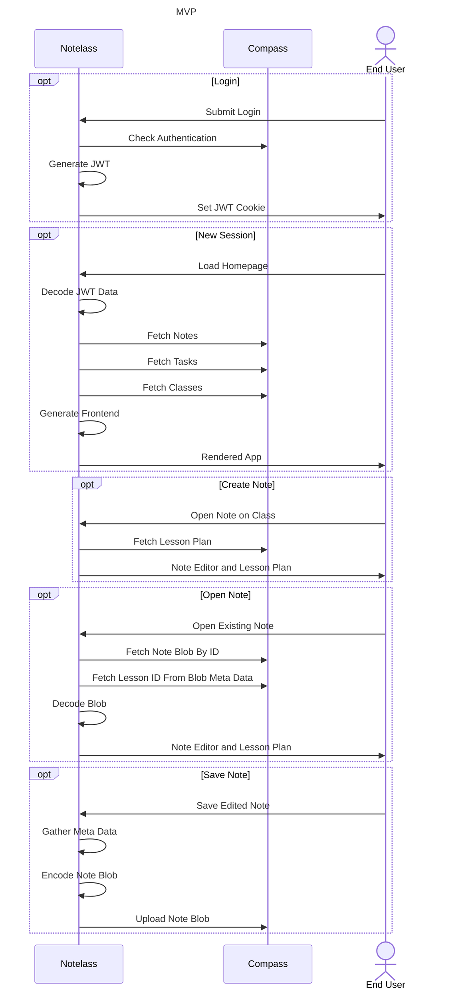
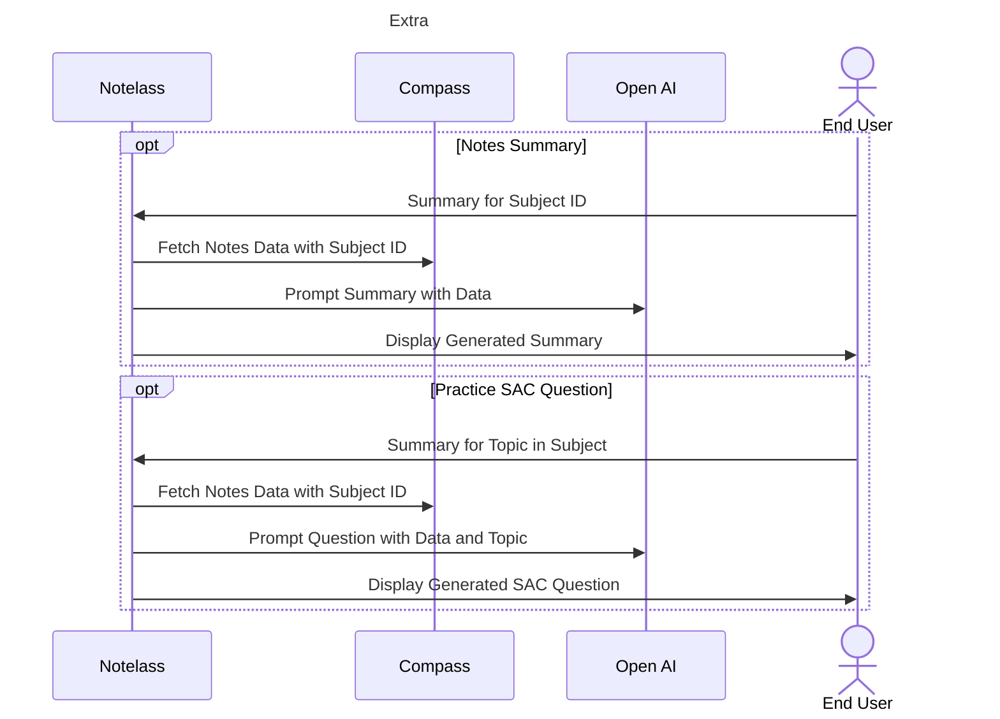
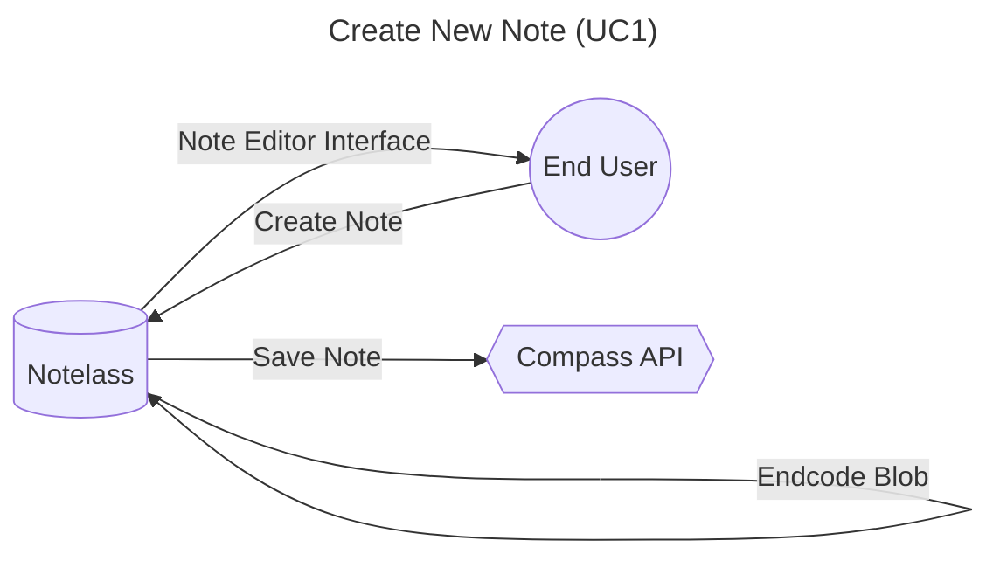
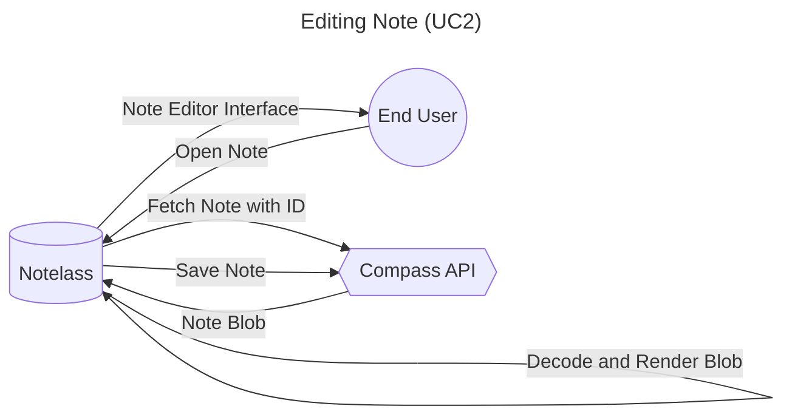
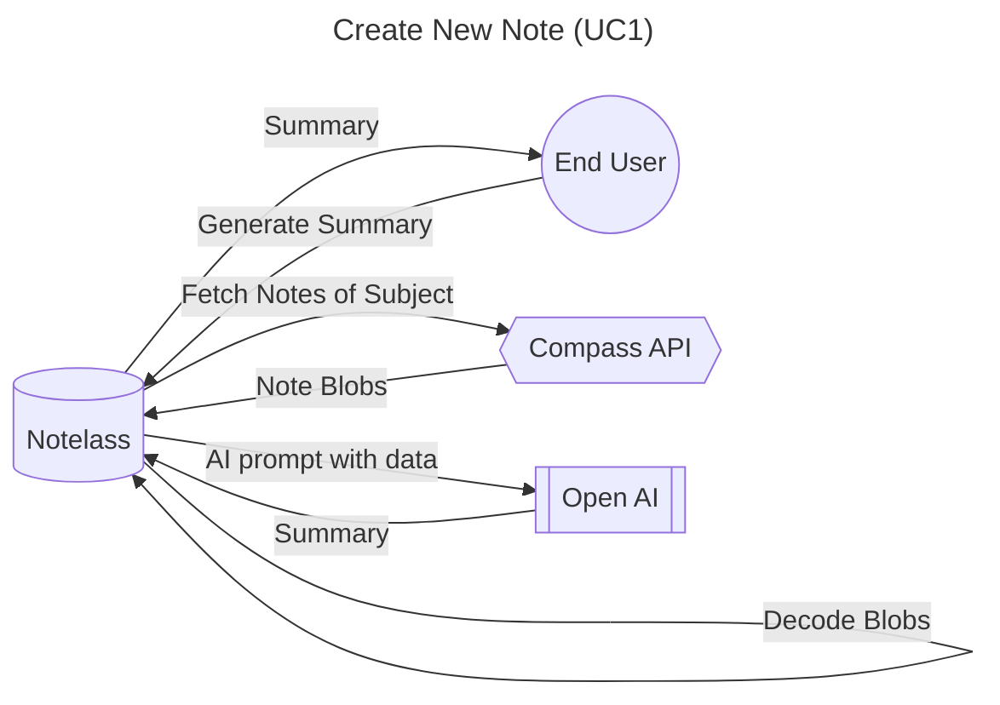

# Notelass
## Project Description
Notelass will be a tool for students at Mullauna College to efficiently and effectively take organised notes for their classes and provide revision tools for students to retain and apply information from their notes. The solution will seamlessly integrate with the schools current online management software, Compass, this will allow students to attach notes to subjects and classes for easy organisation, view class resources within the tool to avoid context switching hindering the users train of thought and store all user generated data within Compass to ensure proper security.
# Client
## Details
Name: Joel Porter
Position: System Admin
Company: Mullauna College
## Needs
Currently Mullauna College has no standard system for note taking or revision, leaving students to implement their own systems or adopt various products not specifically designed for an education environment.

Notelass will provide a standardised platform for students to take notes for their subjects by attaching notes to each class they take for easy organisation and retrieval. The tool will integrate emerging AI technologies to create revision and practice materials / tools for students to effectively apply and recall the information that they document within their notes.
## End User
Notelass is primarily intended to be used by VCE students at Mullauna College as they will gain the most value from the product, however its design will make it accessible to all students at the college.

# Data Collection
## Methods

| Collection Method | Target      | Justification                                                                                        |
| ----------------- | ----------- | ---------------------------------------------------------------------------------------------------- |
| Interview         | Joel Porter | In person interview with the client to understand their needs, requirements and scope of the project |
| Survey            | End Users   | Survey of end users to find popular feature requests for the project and needs of the end user       |
## Interview Notes
```
- Storing all data in compass
- notes editor
- upcoming learning tasks
	- progress check
	- keeping on top of tasks
	- comments on progress
- extracting tasks from lesson plans
- linking notes to activity and lesson
- tagging notes with topics
- viewing lesson plan
- revision
	- context to class notes, lesson plans and VCAA
	- generate summaries from users notes, topics and lesson plans
	- ai to create flash cards, practice SAC questions and quiz (short answer and multiple choice), created from notes at different difficulties, (context to previous exams)
```

## Feature Survey Results

| Feature Requested | Count Requests |
| ----------------- | -------------- |
| AI notes summary  | 3              |
| WYSIWYG editor    | 4              |
| Markdown Support  | 5              |
| LaTeX Support     | 4              |
| Revision tools    | 5              |
# Project Scope
## Includes
- Note taking page
- Note syntax validation
- Notes storage in Compass
- Categorisation and filtering of notes
- Compass lesson plan viewer
- Compass class resource downloads
- Compass learning task timeline
- Notes filtering
- AI home learning detection
- AI notes summary
- AI content quiz
- AI practice SAC questions
## Excludes
- Compass task submission
- Compass news feed
- Compass discussions
- Compass emails
- AI revision with content not in notes
- AI notes summary with content not in notes
- Use of generative AI for classwork
## Operating Environment
Notelass will operate with a modern JavaScript framework and serverless functions to allow for cost free deployment on various third-party services.
- SvelteKit as a web framework
	- Svelte front end for simple static site generation
	- JavaScript API functions to store, serve and manipulate data
	- Serverless functions for horizontal scalability and easy deployment
- Compiled HTML/CSS/JS Svelte user interface
	- Requests to Compass for data storage and retrieval 
	- Minimal design to improve client performance on low end hardware
# Diagrams


# Requirements
## Constraints

| ID  | Type         | Notes                                                  |
| --- | ------------ | ------------------------------------------------------ |
| PC1 | Economic     | Time available for the project is 24 weeks             |
| PC2 | Economic     | Project should only utilise free products and services |
| PC3 | Technical    | Needs to be easy to deploy as an instance              |
| PC4 | Availability | Must run in a serverless enviroment                    |
| PC5 | Legal        | End User will have full control of their data          |
| PC6 | Technical    | Runs without any errors or bugs                        |
| PC7 | Social       | Easy and Intuitive to use for a student                |
## Functional

| ID   | Requirement                                        | Notes                                                                                                                                                                                              |
| ---- | -------------------------------------------------- | -------------------------------------------------------------------------------------------------------------------------------------------------------------------------------------------------- |
| FR1  | User can login with Compass                        | Login page makes request to Compass to authenticate details and returns user details in a JWT for further requests                                                                                 |
| FR2  | Only authenticated users can access tools and data | JWT verification on all routes to only be used by authenticated users                                                                                                                              |
| FR3  | Unauthorised users can access documentation        | Open route for viewing documentation that allows unauthenticated users                                                                                                                             |
| FR4  | Requests to compass API are authorised             | Compass API requests are properly authenticated with data from the JWT without errors                                                                                                              |
| FR5  | Functional note editor with markdown and LaTeX     | WYSIWYG editor works seamlessly live rendering of markdown syntax / LaTeX formulas and loading / exporting to plain text                                                                           |
| FR6  | Notes are stored in and retrieved from Compass     | Exported notes are saved in Compass with appropriate metadata (subject, class and date) on the users account and all notes can be retrieved efficiently for viewing or further editing by the user |
| FR7  | Class resources can be viewed                      | Class lesson plan and resources are fetched from the compass API for viewing by the user when editing notes                                                                                        |
| FR8  | Notes can be filtered by subject, date and class   | Notes overview page has filters for metadata that allows the user to refine displayed notes and search for subject, date and class                                                                 |
| FR9  | User can view upcoming tasks from Compass          | Learning tasks for the user are fetched from Compass and are displayed in a timeline in addition to user defined tasks.<br>                                                                        |
| FR10 | Documentation is dynamically rendered              | Documentation statically stored in markdown files on the server is rendered and displayed with the notes editor in the documentation route                                                         |
| FR11 | Admin can optionally enable AI revision for users  | As AI use requires a paid API key it should be be optionally enabled with environment variables, if disabled the routes and pages for revision tools will not be shown to users                    |
## Non-Functional

| ID   | Requirement             | Notes                                                                                                             |
| ---- | ----------------------- | ----------------------------------------------------------------------------------------------------------------- |
| NFR1 | Intuitive Design        | 90% of users will be able to create and retrieve a note without any prior instruction                             |
| NFR2 | Accessible Themes       | Users should have at least 3 different interface themes to choose from when using the website.                    |
| NFR3 | No downtime             | The website should implement a CI/CD system with serverless hosting to allow for seamless version upgrades        |
| NFR4 | Backwards compatability | New versions of Notelass should not break the functionality of existing notes and should allow for continuous use |
| NFR5 | Quick navigation        | A user should not require more than 5 clicks to find any of their notes throughout the app                        |
# Use Cases
## Requirements

| ID  | Use Case                 | Notes                                                                                                    |
| --- | ------------------------ | -------------------------------------------------------------------------------------------------------- |
| UC1 | Create new Note          | User creates a note for a class at school and saves content they have documented throughout class        |
| UC2 | Editing Note             | User edits a notes previously created content to add extra information before saving once again          |
| UC3 | AI Practice SAC question | A user selects a topic from one of their subjects and generates a practice SAC question from their notes |
## Diagrams



